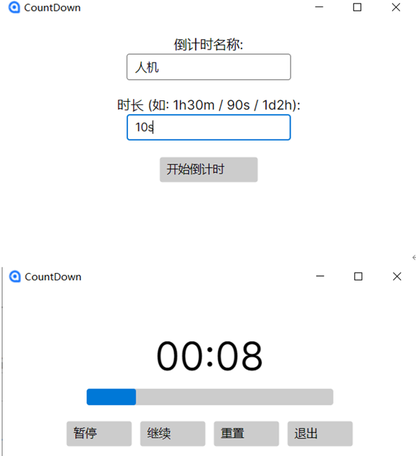
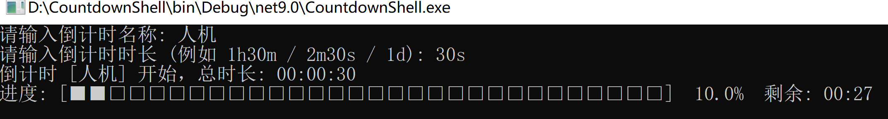

# countdown的C#实现

这个文件夹（可以称为一个解决方案）用C#实现了countdown的功能，主要包含以下几个项目：
- CountdownAvalonia：一个基于Avalonia的桌面应用程序，提供图形界面供用户输入倒计时名称和时长，并显示倒计时过程。
- CountdownShell：一个基于控制台的应用程序，用户通过命令行输入倒计时名称和时长，程序在控制台显示倒计时过程。

要运行这些项目，你需要安装.NET SDK，并使用Visual Studio或命令行工具进行构建和运行。要安装.NET SDK，可以访问[微软的官方网站](https://dotnet.microsoft.com/download)，选择适合你操作系统的版本进行下载和安装；也可以使用包管理工具如Chocolatey（Windows）或Homebrew（macOS）来安装.NET SDK：
- Windows（使用Chocolatey）：
  ```bash
  choco install dotnet-sdk
  ```
- macOS（使用Homebrew）：
  ```bash
    brew install --cask dotnet-sdk
    ```
安装完成后，你可以使用以下命令来构建和运行项目：
- 构建项目：
```bash
dotnet build
```
- 运行项目：
```bash
dotnet run --project CountdownAvalonia
```
如果你想运行Shell版本，直接运行即可;

如果你想运行Avalonia版本，就要安装Avalonia的包：
```bash
dotnet add package Avalonia
```


> 这些实现不够好，你也可以自己动手实现一个更好的版本！如果你有任何问题或者建议，欢迎投(issue)[https://github.com/Jack-tendy-538/countdown/issues]！