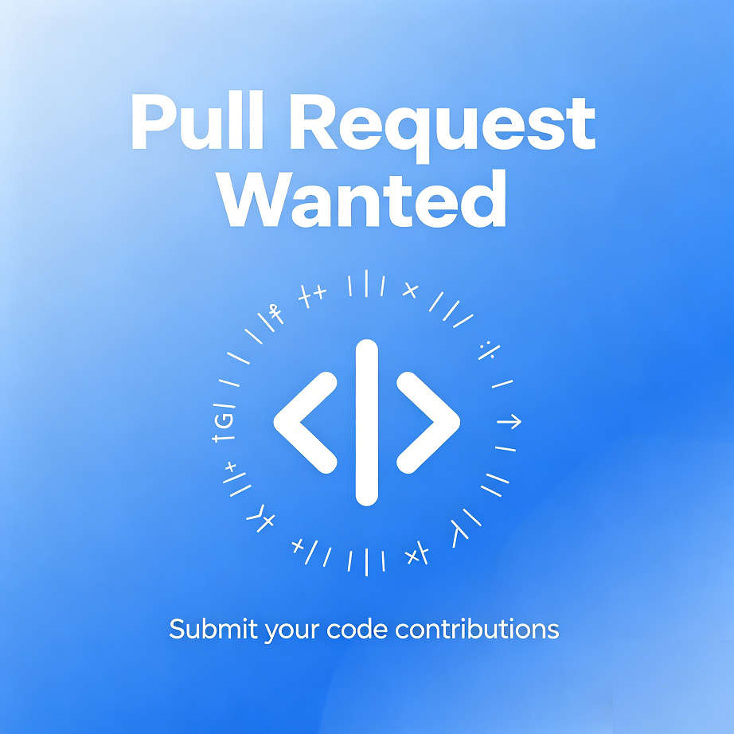

# countdown倒计时

用**5种语言**实现的倒计时应用，代码基本不涉及高级概念，适合**初学者**入门！

## :thinking: 怎么跑
这个仓库用门语言实现了倒计时程序，共八个项目，彼此相对独立（但可能用了相同的库）
可以自定义倒计时的名称与时长，支持“开始”、“暂停”与“重置”操作。具体如下表：
| 语言 | 项目名 | UI模式 |
|------|-----|-----|
| python | countdown_shell | shell |
|  | countdown_tkinter | GUI |
| C# | CountdownShell | shell |
| | CountdownAvalonia | GUI |
| F# | Countdown | shell |
| C++ | countdown_shell | shell |
| HTML | Countdown | GUI(网页) |
| shell | countdown(pwsh&bash) | shell |

## :frowning: 设计理念
尽管倒计时的呈现方式各有不同，但它们的底层逻辑都是相同的：规定一个时长，在一个时间点开始，那么等待时长结束即可。不过，为了增加难度，我们加入了暂停逻辑。

## :heart: 贡献

其实，开发这个仓库的我也是一个初学者，欢迎各位来fork我的仓库！

没有issue的仓库是可悲的，欢迎各位提出issue！

如果这个仓库启发了你，请点亮star。
