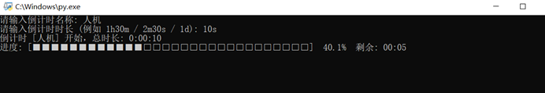
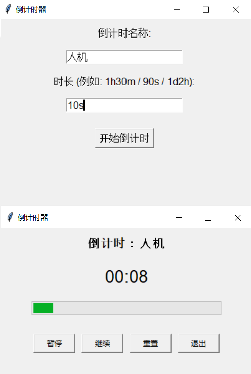
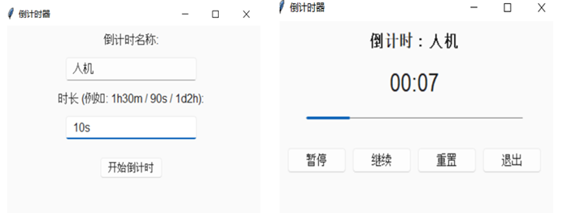

# countdown的python实现

这个文件夹用python实现了countdown算法，主要包含以下文件：
- `countdown_base.py`：实现了countdown算法的底层逻辑。
- `countdown_shell.py`：提供了一个简单的命令行界面，允许用户输入倒计时时长并用`ctrl+c`来停止倒计时。
- `countdown_tkinter.py`：使用tkinter库创建了一个图形用户界面，用户可以输入倒计时时长并点击按钮开始倒计时。

要运行这些文件，你需要安装python环境.要安装python，可以访问[python官网](https://www.python.org/downloads/)下载并安装适合你操作系统的版本;也可以运行以下命令来安装python：

```bash
# 对于Debian/Ubuntu系统
sudo apt update
sudo apt install python3
# 对于macOS系统
brew install python
# 对于Windows系统
# 你可以从python官网下载并安装，或者使用包管理工具如Chocolatey
```

这里包含了两个项目：
| 项目名称 | 描述 |
| --- | --- |
| `countdown_shell.py` | 提供了一个简单的命令行界面 |
| `countdown_tkinter.py` | 使用tkinter库创建了一个图形用户界面 |

当然，如果你觉得tkinter的界面不够好看，你也可以自己手搓sv_ttk，像这样：
```python
# ...已有的代码...
from countdown_base import parse_span, CountDown
import sv_ttk

class CountdownApp:
    def __init__(self):
        self.root = tk.Tk()
        sv_ttk.set_theme("light")  # 可选 "dark" 或 "light"
# 后面所有tk组件都使用ttk版本
```
结果如下：


> 这些实现不够好，你也可以自己动手实现一个更好的版本！如果你有任何问题或者建议，欢迎投(issue)[https://github.com/Jack-tendy-538/countdown/issues]！